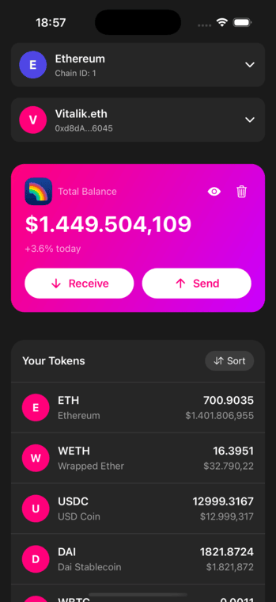

<div align="center">
  
</div>

# Rainbow Wallet Demo

A simple yet powerful cryptocurrency wallet demo showcasing wallet creation, management, and token balance viewing capabilities across multiple networks.

## Features

- Secure wallet creation with seed phrase backup
- Support for Ethereum and Base networks
- View native token and top tokens per network
- Clean and modern UI with dark theme
- Offline-capable with local storage of wallet data
- Extensible architecture for adding new networks
- Wallet address book with famous addresses
- Balance hiding for privacy
- Share and copy wallet address functionality

## Tech Stack

- React Native / Expo
- TypeScript
- Ethers.js for wallet functionality
- Zustand for state management
- Expo SecureStore for secure storage
- Expo Router for navigation
- Expo Blur for UI effects
- React Native Bottom Sheet

## Getting Started

1. Install dependencies:

```bash
npm install
```

2. Start the development server:

```bash
npm start
```

3. Run on iOS or Android:

```bash
npm run ios
# or
npm run android
```

## Project Structure

```
/app
  ├── /screens          # Main screen components
  ├── /components      # Reusable UI components
  ├── /store          # Zustand state management
  ├── /config         # Network and token configurations
  └── /assets         # Images and other static assets
```

## Security Features

- Seed phrases are encrypted and stored securely using Expo SecureStore
- No cloud storage of sensitive data
- All wallet operations are performed locally
- Network requests only for reading blockchain data
- Secure balance hiding option

## Supported Networks

### Ethereum

- Native ETH
- USDC
- WBTC
- WETH
- DAI

### Base

- Native ETH
- USDC
- WBTC
- WETH
- USDbC
- DAI

## Contributing

Feel free to submit issues and enhancement requests!
